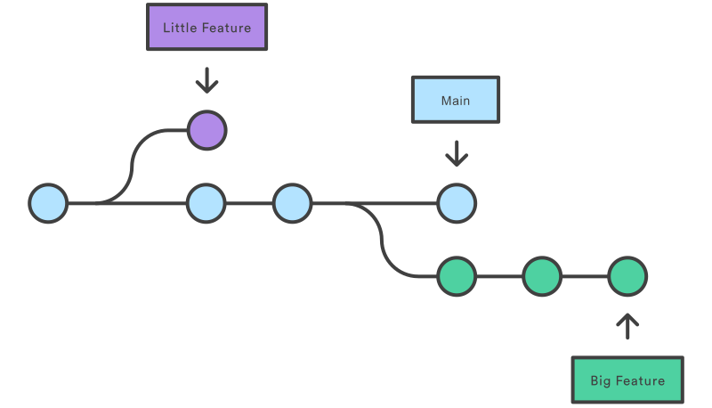

# Git

Git is a powerful version control system that allows you to track changes to your code over time and collaborate with other developers. 

Git thinks of its data more like a series of snapshots of a miniature filesystem: every time you commit, or save the state of your project, Git basically takes a picture of what all your files look like at that moment and stores a reference to that snapshot.

For more detailed information about git, you can look at the book [Pro Git](https://git-scm.com/book/en/v2). It is completely free.

Once you have a repository set up, here are some basic Git commands that you'll use frequently:

- **git init**: This command initializes a new Git repository in the current directory. It creates a hidden folder called .git, which contains all of the necessary metadata for your repository.
- **git clone <url>**: This command clones an existing Git repository from a remote location (such as GitHub) to your local machine. The URL should point to the main branch of the repository.
- **git status**: This command shows the current state of the repository, including any untracked or modified files.
- **git add <file>**: This command adds a specific file to the staging area, which means that it is ready to be committed. You can also use git add . to add all changed files at once
- **git commit -m "<message>"**: This command commits the changes in the staging area with a message describing what was changed. The message should be brief but descriptive.
- **git log**: This command displays a history of all previous commits, along with their messages and author information.
- **git pull**: This command fetches the latest changes from the remote repository and merges them into your local repository.
- **git push**: This command pushes your local commits to the remote repository, making them available to other users who might be working on the project.

## Git Stages

Git uses a three-stage model to manage changes to your codebase: the working directory, the staging area, and the repository. Each stage has a different role in the Git workflow, allowing you to carefully manage changes and ensure that your commits accurately reflect the intent behind each modification.

Here's a breakdown of each stage:

- **Working Directory**: The working directory is where you actually edit your source code files. Any modifications you make to these files exist solely within your local workspace until you explicitly choose to stage and commit them.

- **Staging Area**: The staging area, also known as the index, serves as a buffer between the working directory and the repository. When you stage a file, Git takes a snapshot of its current state and moves it from the working directory to the staging area. At this point, the staged file is still modifiable, but its current state is marked for inclusion in the next commit. By staging only certain parts of a larger modification, you can break down complex changes into smaller units, making it easier to reason about each step and ensuring that your commits represent coherent logical chunks rather than monolithic blobs of undifferentiated code.

- **Repository**: The repository is the final resting place for all committed changes. Once you've staged and committed your changes, they become part of the permanent record stored in the repository. These changes are now safely backed up and accessible to other team members via the central server or cloud hosting service.

The following figure shows the different stages:


A basic git workflow would be as follows:

1. You modify files in your working tree.

2. You selectively stage just those changes you want to be part of your next commit, which adds only those changes to the staging area.

3. You do a commit, which takes the files as they are in the staging area and stores that snapshot permanently to your Git directory.

## Git branches

At the heart of Git lies the concept of branches—lightweight pointers that allow multiple people to work independently on different features or fixes simultaneously, without stepping on each other's toes. A Git branch is simply a label pointing to a particular commit, serving as a visual cue for where the codebase currently stands relative to other versions.



There are several branching strategies employed by teams, ranging from simple single-branch models to more sophisticated multi-branch patterns like GitFlow or Github Flow. Regardless of the strategy chosen, all involve creating, updating, merging, and occasionally abandoning branches to facilitate concurrent development and smooth integration of diverse features.

We recommend the following additional resources to practice branching:

- [Atlassian git branching blog](https://www.atlassian.com/git/tutorials/using-branches)
- [Interactive git branching](https://learngitbranching.js.org/?locale=es_AR)

### Common Branching Operations

Here are some common operations related to Git branches:

- Create a new branch: Use the **git branch** command followed by the name of the new branch to create a new branch from the current branch. For instance, to create a new branch called *bugfix/login*, execute:

```
git branch bugfix/login
```

- Switch to a different branch: Employ the git checkout command to move to a different branch. For instance, to switch to the bugfix/login branch, type:

```
git checkout bugfix/login
```

- List existing branches: Run the git branch command without arguments to show a list of all existing branches and highlight the currently active one.

```
git branch -a
```

A possible result would look like: 

```
  bugfix/login
* develop
  master
```

- Merge two branches: Use the git merge command to combine two branches together. Typically, you would merge a feature or bugfix branch into the primary development or maintenance branch. For instance, to merge the bugfix/login branch into develop, issue:

```
$ git checkout develop
$ git merge bugfix/login
```

- Delete a branch: After successfully integrating a branch's changes into another branch, you can delete the original branch with the git branch command followed by the -d option. For example, to delete the bugfix/login branch, enter:

```
git branch -d bugfix/login
```

To delete the remote branch, you can use the following command:

```
git push origin -d bugfix/login
```

## Git Using Github flow

GitHub flow is a lightweight, branch-based workflow. The GitHub flow is useful for everyone, not just developers. You can find the complete documentation for github flow [here](https://docs.github.com/en/get-started/using-github/github-flow).

The basic steps are the following:

- Create a branch in your repository. A short, descriptive branch name enables your collaborators to see ongoing work at a glance. For example, `increase-test-timeout` or `add-code-of-conduct`.
- On your branch, make any desired changes to the repository:
  - Your branch is a safe place to make changes. If you make a mistake, you can revert your changes or push additional changes to fix the mistake. Your changes will not end up on the default branch until you merge your branch.
  - Commit and push your changes to your branch. Give each commit a descriptive message to help you and future contributors understand what changes the commit contains. For example, fix typo or increase rate limit.
  - Ideally, each commit contains an isolated, complete change.
  - Continue to make, commit, and push changes to your branch until you are ready to ask for feedback.
- Create a pull request to ask collaborators for feedback on your changes. When you create a pull request, include a summary of the changes and what problem they solve. You can include images, links, and tables to help convey this information. If your pull request addresses an issue, link the issue so that issue stakeholders are aware of the pull request and vice versa. 
- Address review comments. Reviewers should leave questions, comments, and suggestions.
- Reviewers can comment on the whole pull request or add comments to specific lines or files.
- Once your pull request is approved, merge your pull request. This will automatically merge your branch so that your changes appear on the default branch. GitHub retains the history of comments and commits in the pull request to help future contributors understand your changes.