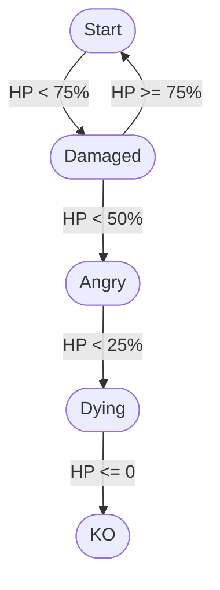
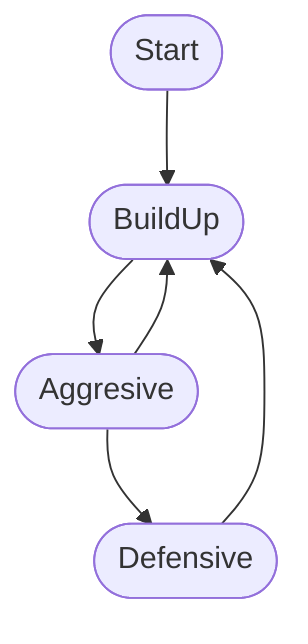

# Finite State Machines for AI

## Simple behaviour based on health

```mermaid
flowchart TD

1([Start])
2([Damaged])
3([Angry])
4([Dying])
5([KO])

1 -- HP < 75% --> 2
2 -- HP >= 75% --> 1
2 -- HP < 50% --> 3
3 -- HP < 25% --> 4
4 -- HP <= 0 --> 5
```

## Behaviour based on cards

```mermaid
flowchart TD

1([Start])
2([Aggresive])
3([Defensive])
4([BuildUp])

1 --> 4
4 --> 2
2 --> 3
2 --> 4
3 --> 4
```