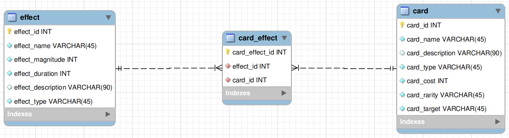

 
# MySQL Connection Package

This application contains an Express server with CRUD operations connected to a MySQL database. It provides routes for getting cards, adding cards, updating cards, and deleting cards.

The application assumes you have already created the database from the [cards_db.sql](../../files/cards_db.sql) file. The Entity Relationship diagram for the DB is the following:



## MySQL module

The `mysql2` module is a Node.js driver for MySQL that provides a fast and efficient way to interact with MySQL databases.
It is a drop-in replacement for the original `mysql` module, but with added features and improved performance.
 
Features:
- Support for both Promise-based and callback-based APIs.
- Connection pooling for efficient management of database connections.
- Support for prepared statements and parameterized queries.
- Automatic type casting for MySQL data types.
- Support for multiple result sets and streaming result sets.
 
### Installation:

You can install the `mysql2` module using npm by running the following command:

```
npm install mysql2
```
 
### Usage:

To use the `mysql2` module in your Node.js application, you need to require it first:

```javascript
import mysql from "mysql2/promise";
```
 
Once you have required the module, you can create a connection to your MySQL database using the `createConnection` method:

```javascript
async function connectToDB() {
        return await mysql.createConnection({ 
        host: 'localhost',
        user: 'root',
        password: 'password',
        database: 'mydatabase'
    })
}
```

You can then execute SQL queries using the connection object. For example, to execute a simple SELECT query:

```javascript
connection = await connectToDB();
const [results, fields] = await connection.execute("select * from card");

console.log(`${results.length} rows returned`);
console.log(results);
```
 
For more information on how to use the `mysql2` module, you can refer to the official documentation: 

[MySQL2 Documentation](https://github.com/sidorares/node-mysql2)

### Prerequisites

Make sure you have the following prerequisites installed on your computer:

*   [Node.js](https://nodejs.org/)

## Dependencies

The project requires the following dependencies:

- Express: A fast and minimalist web framework for Node.js. Version 4.18.2 is used in this project.
- Mysql2: MySQL client for Node.js with focus on performance. 
- Nodemon: A utility that monitors for changes in your source code and automatically restarts the server.

To install these packages, run the following command in your terminal:

```bash
$ npm install
```
It is important to mention that nodemon has to be installed as a global package:

```bash
$ npm install -g nodemon
```

### Running the application

Run the application by running the following command in terminal:

```bash
$ npm start
```

The server will be listening on port 5000.

Access the endpoint at <http://localhost:5000/api/cards> to get all cards. Use other endpoints to perform different CRUD operations.

### Table of Endpoints

 Sure! Here is the revised version of the API documentation in table form:

| Method | URI                         | Request Body   | Query Params | Response Status Code | Description               |
| --- | --- | --- | --- | --- | --- |
| **GET** | /api/cards                  | None           | None         | 200 OK            | Fetches all cards       |
| **GET** | /api/cards/:id             | None           | :id         | 200 OK            | Fetches a card by ID     |
| **POST** | /api/cards              | [{...}]        | None         | 200 OK            | Adds one or more cards  |
| **PUT** | /api/cards/:id             | [{...}]        | :id         | 200 OK            | Updates a card by ID     |
| **DELETE** | /api/cards/:id          | None           | :id        | 200 OK            | Deletes a card by ID     |

Where `[{...}]` represents a JSON array containing objects with properties like:

```json
{
  "card_name": "Example Name",
  "card_description": "Example Description",
  "card_type": "Example Type",
  "card_cost": "Example Cost",
  "card_rarity": "Example Rarity",
  "card_target": "Example Target"
}
```
